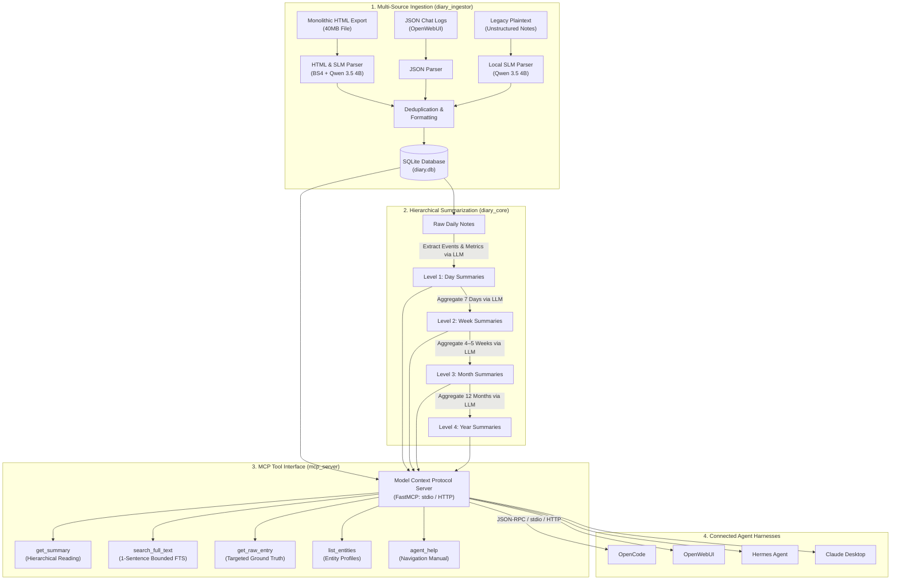

# Local-First Hierarchical Knowledge Engine & MCP Server for Long-Horizon Text Streams

> **Stack:** Python · SQLite (FTS5) · FastMCP · llama.cpp / vLLM · aiohttp · BeautifulSoup4 · Pytest

---

## TLDR

In this project, I engineered a local-first knowledge engine and Model Context Protocol (MCP) retrieval architecture for querying long-horizon temporal text streams offline. I validated the system on a 6-year, 100MB+ heterogeneous dataset spanning monolithic HTML exports, JSON logs, and plaintext notes with strict data sovereignty.

The standard approach for querying large text archives is vector-based Retrieval-Augmented Generation (RAG). However, on longitudinal queries spanning multi-year timelines (such as comparing habits, projects, or recurring patterns between Summer 2024 and Summer 2025), vector RAG fails for three reasons:
- **Semantic Collisions Across Time:** Querying recurring themes (sleep, training, diet) causes vector search to pull text chunks scattered randomly across all 6 years, flooding the prompt with notes from 2021 when the query asked about 2024 vs 2025.
- **Loss of Timeline Continuity:** Vector embeddings lack chronological order. The model receives disconnected snippets without the surrounding weeks or months needed to understand cause and effect.
- **Context Window Overflow:** Dumping dozens of raw daily notes to cover a multi-month period quickly saturates the context window of local LLMs running on consumer GPUs.

To solve this, I engineered a 4-tier hierarchical summarization pipeline (Day → Week → Month → Year) exposed through a local Model Context Protocol (MCP) server. This provides local agents with tools for structured top-down navigation: an agent can scan annual overviews, isolate relevant weeks, probe the days surrounding candidate dates, and extract targeted 1-sentence keyword snippets without filling up the context window.

**Core System Architecture:**
- **Heterogeneous Multi-Source Ingestion:** Ingests and normalizes monolithic 40MB HTML exports, JSON conversation logs, and unformatted plaintext notes into a SQLite database with FTS5 indexing, using a compact local SLM (Qwen 3.5 4B) to categorize HTML dialogue pairs and extract structured daily records from unstructured text.
- **4-Tier Hierarchical Summarization Engine:** Compresses 6 years of raw notes / entries into a structured Day → Week → Month → Year summary pyramid. Each level stores key events with timestamps, scalar daily metrics (sleep, energy, mood), and thematic tags, giving agents a navigable map of the entire dataset without loading raw notes into the prompt.
- **Top-Down Agent Traversal:** Equips local agents with retrieval tools (multi-level summary reading, adjacent date inspection, bounded keyword search) and structured instructions to navigate from annual overviews down to specific days, pulling raw text only when target dates are confirmed.
- **Harness-Agnostic MCP Integration:** Exposes data and retrieval tools as a local Model Context Protocol (MCP) server, allowing the knowledge engine to plug directly into any existing or future agent frontend (OpenCode, OpenWebUI, Hermes Agent, Claude Desktop) without modifying backend code.

**Outcome:** The system enables local LLMs to navigate and query 6+ years of personal history on consumer hardware (NVIDIA RTX 3070 / RTX 4090 via `llama.cpp` / `vLLM`) with zero private data leakage, covered by **142 automated unit tests** passing in **~3.5 seconds**.

---

## System Architecture Diagram



---

## 1. Heterogeneous Multi-Source Ingestion & Local SLM Parsing

Real-world temporal text streams rarely share a single schema. To test ingestion across heterogeneous formats, the pipeline (`diary_ingestor`) processes three distinct legacy representations: a monolithic 40MB HTML export with hundreds of conversation sessions, structured JSON logs, and loose plaintext notes. Format-specific parsers extract timestamps, normalize conversation turns, and write clean records into a local SQLite database.

- **Monolithic HTML Parsing:** Used BeautifulSoup4 to traverse the 40MB HTML export, isolating individual conversation sessions, extracting timestamp headers, and preserving the prompt-response turn structure.
- **Local SLM for Unstructured Text & Classification:** Where standard regex failed on messy legacy `.txt` files and complex HTML dialogue blocks, I used a compact local model (**Qwen 3.5 4B via `llama.cpp` / `vLLM`**) to extract dates, identify daily boundaries, and categorize message turns into clean schema records.
- **Incremental Hash Deduplication:** Computed SHA-256 hashes for every entry's content and timestamp to ensure idempotent ingestion. Re-running the pipeline processes the dataset in seconds and skips already-ingested entries with zero duplicates.
- **SQLite Database with FTS5 Search:** Stored all normalized entries in a centralized SQLite database with an `FTS5` full-text index, enabling microsecond keyword lookups across the entire 6-year history.

> **Outcome:** Normalized **632 discrete daily entry bundles** spanning 2020–2026 into a ~90MB database, executing incremental updates with zero duplicate records.

---

## 2. Compute-Constrained Hierarchical Summarization & Cache Invalidation

Answering open-ended questions across multi-year text streams (such as tracking the onset and multi-month progression of an injury or project) requires searching the dataset without knowing target timestamps in advance. Ingesting the full 100MB+ corpus (~25M tokens) exceeds local context limits, while agent swarms scanning raw notes on consumer GPUs take days or incur massive cloud API costs. Meanwhile, vector RAG scatters matches across unrelated years, destroying timeline continuity.

To solve this, I engineered a pre-computed 4-tier hierarchical summarization engine (`diary_core`) that acts as a navigable roadmap of the entire 6-year corpus. By progressively abstracting raw notes into day, week, month, and year summaries, local agents can orient themselves at the macro level and drill down to exact dates without overflowing their context window:

```
                          [ Level 4: Year Summary (12 Months) ]
                                            ▲
                        [ Level 3: Month Summaries (4–5 Weeks) ]
                                            ▲
                         [ Level 2: Week Summaries (7 Days) ]
                                            ▲
                  [ Level 1: Daily Summaries (Target Day + Prior Context) ]
                                            ▲
                       [ Level 0: Raw Daily Notes (SQLite DB) ]
```

- **4-Tier Cascading Summaries:**
  - **Level 1 (Day Summaries):** Synthesizes raw daily entries while maintaining a rolling context window over preceding days, extracting key events, interpersonal notes, scalar metrics (sleep, energy, mood), and habit tags.
  - **Level 2 (Week Summaries):** Synthesizes 7 sequential daily summaries into weekly highlights and behavioral trends.
  - **Level 3 (Month Summaries):** Synthesizes 4–5 weekly summaries into monthly arcs and progress milestones.
  - **Level 4 (Year Summaries):** Synthesizes 12 monthly summaries into high-level annual overviews.
- **Hash-Based Stale Cache Invalidation:** To prevent redundant LLM compute, every summary stores a SHA-256 hash of its source inputs. When a journal entry is edited or added, the system re-summarizes only the affected day, week, month, and year branch, leaving the remaining 99% of the database untouched.
- **Local-First with Optional Cloud Backfill:** Built to run 100% locally via `llama.cpp` / `vLLM` on consumer GPUs for complete privacy. For users prioritizing initial setup speed over strict offline privacy, the pipeline also supports asynchronous cloud execution (via OpenRouter) to process the multi-year backlog in parallel, drastically reducing the time required compared to sequential local runs.

> **Outcome:** Synthesized 6 years of records into a complete 4-tier hierarchy on local consumer hardware (NVIDIA RTX 3070 / RTX 4090), enabling instant incremental updates whenever new journal entries are added.

---

## 3. Top-Down Agent Traversal & Token-Bounded Retrieval

Pre-computing a summary hierarchy creates the map, but an autonomous agent needs a clear navigation strategy to explore it. Without explicit traversal instructions, an agent easily falls into two failure modes: reading too many raw notes or low-level summaries quickly fills up the context window, while stopping prematurely at high-level week or month summaries leads to answering questions without checking the underlying ground-truth data, significantly increasing the risk of hallucination.

To resolve this tradeoff, I engineered a top-down traversal protocol paired with token-efficient MCP tools. When answering broad or comparative questions, the agent begins by scanning annual overviews to isolate the relevant timeframe, narrows candidate windows through monthly and weekly summaries, and retrieves raw daily notes only for confirmed dates to verify facts against ground truth before generating a response:

```
User Query: "Compare my sleep consistency and training routine between Summer 2024 and Summer 2025, and identify key drivers."

┌────────────────────────────────────────────────────────────────────────────────────────────────────────┐
│  Step 1: Anchor Macro Context                                                                          │
│  → get_summary(level="year", ["2024", "2025"])                                                         │
│  Agent establishes annual baseline trends, major life milestones, and overall health scores.          │
├────────────────────────────────────────────────────────────────────────────────────────────────────────┤
│  Step 2: Inspect Target Months                                                                         │
│  → get_summary(level="month", ["2024-06", "2024-07", "2025-06", "2025-07"])                            │
│  Agent compares monthly averages (sleep scores, workout frequency) and flags anomalous weeks.         │
├────────────────────────────────────────────────────────────────────────────────────────────────────────┤
│  Step 3: Drill Down into Notable Weeks                                                                 │
│  → get_summary(level="week", ["2024-W24", "2025-W25"])                                                 │
│  Agent isolates specific drops in sleep quality linked to work deadlines and travel schedules.        │
├────────────────────────────────────────────────────────────────────────────────────────────────────────┤
│  Step 4: Targeted Ground Truth                                                                │
│  → get_raw_entry(["2024-06-14", "2025-06-18"])                                                         │
│  Agent retrieves exact journal text ONLY for 2 pivotal dates to extract concrete details and quotes.  │
└────────────────────────────────────────────────────────────────────────────────────────────────────────┘
Result: Synthesizes an accurate comparative report with zero cross-year confusion and minimal prompt bloat.
```

- **Top-Down Temporal Navigation:** Equips the agent with tools to navigate chronologically from macro to micro. By evaluating Annual and Monthly overviews first, the agent narrows a 6-year search space down to specific calendar weeks in 2 tool calls before reading raw notes.
- **1-Sentence Radius FTS Search:** Instead of dumping multi-kilobyte records upon a keyword match, the SQLite FTS5 search tool extracts only the matching sentence plus a **1-sentence bounding radius** (1 sentence before, 1 sentence after). This provides sufficient context to verify relevance without polluting the prompt.
- **Temporal Neighborhood Probing:** When an agent inspects a candidate date, dedicated range-query tools allow probing the immediately adjacent days (e.g. ±3 days) to capture local continuity without pulling full multi-month logs.
- **Longitudinal Entity Tracking:** Exposes pre-indexed entity profiles (collaborators, recurring projects) across multi-year spans, allowing direct retrieval of subject-specific timelines without full database scans.
- **Token-Bounded Discovery Metadata:** Directory and summary listing tools return bounded temporal range metadata (available year/month bounds and record counts) rather than dumping hundreds of raw date strings, preventing token exhaustion during initial exploration.

> **Outcome:** Structured top-down traversal keeps prompt token usage strictly bounded at each step, enabling local agents to complete complex multi-year queries that would otherwise saturate the context window and halt execution.

---

## 4. Harness-Agnostic Serving via Model Context Protocol (MCP)

Coupling knowledge storage directly to a specific user interface or proprietary agent framework creates immediate lock-in. To keep the knowledge engine fully modular, I exposed the entire retrieval pipeline as a standalone **Model Context Protocol (MCP)** server. This allows the knowledge engine to plug into any existing or future agent frontend without modifying backend code:

```
[ Desktop: OpenCode / Claude ] ──( stdio )──┐
                                            ▼
[ Web: OpenWebUI / Network   ] ──( HTTP )──► [ FastMCP Server :8008 ] ──► [ Local Storage ]
                                             │
                                             ├─ get_summary()        (Hierarchical Reading)
                                             ├─ search_full_text()   (1-Sentence Bounded FTS)
                                             ├─ get_raw_entry()      (Ground Truth Lookup)
                                             └─ list_entities()      (Longitudinal Profiles)
```

- **Standardized FastMCP Tool Registry:** Exposes hierarchical summaries, bounded full-text search, and entity profiling as strongly-typed MCP tools with automatic JSON Schema validation.
- **Dual Transport Support:** Runs over standard I/O (`stdio`) for zero-overhead integration with desktop harnesses (OpenCode, Claude Desktop), and streamable HTTP for web-based frontends (OpenWebUI).
- **Strict Local-First Sovereignty:** Operates 100% locally with zero external network calls or telemetry, keeping personal text and queries strictly on local storage.

> **Outcome:** Enabled plug-and-play integration across 4 distinct agent harnesses (OpenCode, OpenWebUI, Hermes Agent, Claude Desktop) without modifying backend code or database schemas.

---

## Developer Quickstart & Execution

### Prerequisites
- Python 3.10+
- (Optional) Local `llama.cpp` / `vLLM` / `Ollama` server for offline local inference.

### 1. Installation
Clone the repository and install dependencies:
```bash
git clone https://github.com/your-username/diary_analyzer.git
cd diary_analyzer
python -m venv venv
source venv/bin/activate  # On Windows: venv\Scripts\activate
pip install -r requirements.txt
```

### 2. Configuration
Copy the environment template and configure local paths:
```bash
cp .env.example .env
```

Key environment options in `.env`:
```ini
# Storage paths
DIARY_DB_PATH=data/diary.db

# Global local LLM endpoint (used by both Ingestion and Summarization)
LLM_API_BASE=http://localhost:8080
LLM_MODEL=qwen3.5-4b

# Optional: Override endpoints separately if using distinct models
# INGESTOR_API_BASE=http://localhost:8080
# ANALYZER_API_BASE=http://localhost:8080
```

### 3. Ingestion & Summarization Pipeline
1. Place raw source files (monolithic Gemini `.html` exports, OpenWebUI `.json` logs, or `.txt` notes) into the raw data directory:
   ```bash
   mkdir -p data/raw_data
   # Place raw files inside data/raw_data/
   ```
2. Execute the automated ETL parser and incremental summary builder:
   ```bash
   python auto_ingest.py
   ```

### 4. Verification
Execute the 142-test automated suite covering ETL parsers, database migrations, FTS5 tokenization, and FastMCP schemas:
```bash
pytest
```

### 5. Connecting to Agent Harnesses

The knowledge engine connects to any MCP-compliant frontend (Claude Desktop, OpenWebUI, OpenCode, Hermes Agent) using your harness's standard MCP addition flow:

* **Standard I/O (`stdio`) Mode:** For desktop applications (e.g. Claude Desktop, OpenCode), register the server command in your client's MCP configuration:
  ```json
  {
    "mcpServers": {
      "diary-knowledge-engine": {
        "command": "python",
        "args": ["-m", "mcp_server.mcp_server", "--mode", "stdio"],
        "env": { "DIARY_DB_PATH": "data/diary.db" }
      }
    }
  }
  ```

* **HTTP Mode:** For web-based or network frontends (e.g. OpenWebUI), launch the server:
  ```bash
  python -m mcp_server.mcp_server
  ```
  Then add `http://localhost:8008/mcp` under your interface's MCP / Tool settings.
